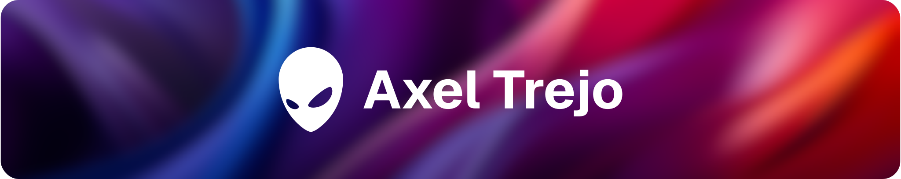
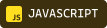
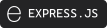

# 💫 Sobre Mí

🦉 Desarrollador full stack con más de dos años de experiencia; diseño y construyo experiencias digitales modernas, funcionales y atractivas. Me especializo en tecnologías web como **⚛️ React**, **🤍 Next.js**, **💚 Node.js** y **💙 TypeScript**, creando soluciones eficientes y escalables. 
🔭 Actualmente estoy trabajando en **🦅 ΣΛGLΣ**, un proyecto personal que busca ser una plataforma todo-en-uno para la gestión y administración de e-commerce. 
🤝 Estoy buscando colaboración para continuar desarrollando esta herramienta y llevarla a la siguiente etapa. 
🌱 Estoy aprendiendo **🦀 Rust** con el objetivo de ampliar mis conocimientos en sistemas de bajo nivel. 
💬 Pregúntame sobre **🤍 Next.js**, un framework con el que disfruto trabajar y explorar nuevas ideas. 
🌐 Visita mi sitio web en [axeltrejo.com](https://axeltrejo.com/es). 

<a href="./README.md">📝 Read in English</a>

# 🧠 Stack Técnico

# 📊 Estadísticas de GitHub

<picture>
<source media="(prefers-color-scheme: dark)" srcset="https://github-readme-stats.vercel.app/api?username=axeltrejodev&hide_title=true&text_color=ddd&icon_color=1f6feb&border_color=3d444d&theme=transparent&include_all_commits=true&disable_animations=true&layout=compact&locale=es&show_icons=true&border_radius=6&card_width=500">
<source media="(prefers-color-scheme: light)" srcset="https://github-readme-stats.vercel.app/api?username=axeltrejodev&hide_title=true&text_color=666&icon_color=0969da&border_color=d1d9e0&theme=transparent&include_all_commits=true&disable_animations=true&layout=compact&locale=es&show_icons=true&border_radius=6&card_width=500">

</picture>
 
<picture>
<source media="(prefers-color-scheme: dark)" srcset="https://github-readme-stats.vercel.app/api/top-langs/?username=axeltrejodev&title_color=fff&text_color=ddd&icon_color=1f6feb&border_color=3d444d&theme=transparent&include_all_commits=true&disable_animations=true&layout=compact&locale=es&border_radius=6&card_width=500">
<source media="(prefers-color-scheme: light)" srcset="https://github-readme-stats.vercel.app/api/top-langs/?username=axeltrejodev&title_color=000&text_color=666&icon_color=0969da&border_color=d1d9e0&theme=transparent&include_all_commits=true&disable_animations=true&layout=compact&locale=es&border_radius=6&card_width=500">

</picture>
